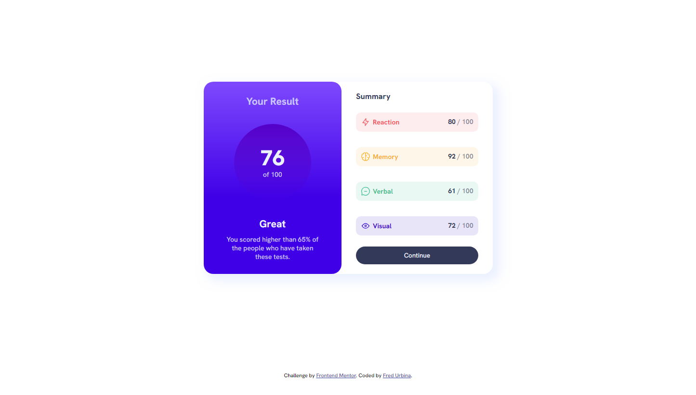
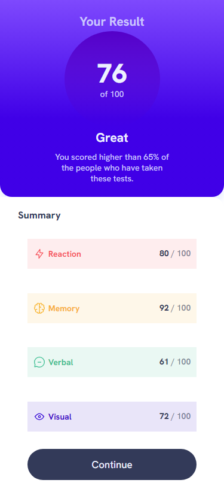

# Frontend Mentor - Results summary component solution

This is a solution to the [Results summary component challenge on Frontend Mentor](https://www.frontendmentor.io/challenges/results-summary-component-CE_K6s0maV). Frontend Mentor challenges help you improve your coding skills by building realistic projects. 

## Table of contents

- [Overview](#overview)
  - [The challenge](#the-challenge)
  - [Screenshot](#screenshot)
  - [Links](#links)
- [My process](#my-process)
  - [Built with](#built-with)
  - [What I learned](#what-i-learned)
  - [Continued development](#continued-development)
- [Author](#author)

**Note: Delete this note and update the table of contents based on what sections you keep.**

## Overview

### The challenge

Users should be able to:

- View the optimal layout for the interface depending on their device's screen size
- See hover and focus states for all interactive elements on the page
- **Bonus**: Use the local JSON data to dynamically populate the content

### Screenshots

#### Desktop

#### Mobile 

### Links

- Solution URL: [My Solution](https://github.com/Gartank/Result-summary-component)
- Live Site URL: [Live Site](https://gartank.github.io/Result-summary-component/)

### Built with

- Semantic HTML5 markup
- Flexbox
- CSS Grid
- Desktop-first workflow

## My Process

### What I learned

Something that I want to highlight, and made me learn a lot, was the style and the use or method of how to use and create color palettes and what elements should have it. I learn a lot from this by doing these challenges, it's not something technical but it makes me a better Front-End Dev. I didn't use JSON because I don't have proper knowledge in JS, but that's what I learned at the time.

## Author

- Frontend Mentor - [@yourusername](https://www.frontendmentor.io/profile/yourusername)
